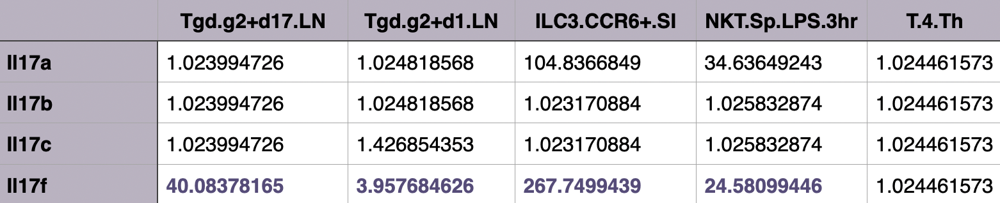

# Characterization of the chromatin landscape surrounding the Il17f gene locus in γδ T-cells
## Overview

- [Research Questions and Methods](#research-questions-and-methods)
    - [Psoriasis: IL17 driven inflammation](#psoriasis-il17-driven-inflammation)
- [Results](#results)
    1. [Enhancers show more variability across cell types than promotors](#1-enhancers-show-more-variability-across-cell-types-than-promotors)
    2. [γδ T-cells cluster by differentiation stage (ATAC-seq and RNA-seq data)](#2-γδ-t-cells-cluster-by-differentiation-stage-atac-seq-and-rna-seq-data)
    3. [Cell type specific genes cluster together in hierarchical clustering](#3-cell-type-specific-genes-cluster-together-in-hierarchical-clustering)
    4. [Ridge regression links ATAC-seq peaks to γδ T‑cell lineage‑specific gene expression](#4-ridge-regression-links-atac-seq-peaks-to-γδ-tcell-lineagespecific-gene-expression)
    5. [OCRs can be linked to gene expression via correlation](#5-ocrs-can-be-linked-to-gene-expression-via-correlation)
    6. [OCRs around the IL17f gene locus](#6-ocrs-around-the-il17f-gene-locus)
- [Conclusion](#conclusion)
- [References](#references)
- [Additional results](#additional-results)

## Research Questions and Methods

Genome-wide association studies have shown that many genetic variants linked to autoimmune disease lie in non-coding regions of the genome, making it difficult to investigate how they influence gene regulation and cell identity (Calderon et al. 2019). To address this, our project combines ATAC-seq and RNA-seq data from the mouse immune system atlas of Yoshida et al., to examine how chromatin accessibility and gene expression relate to each other in  γδ T-cell lineages. ATAC-seq captures open chromatin regions that may act as promoters or enhancers, while RNA-seq measures gene expression but does not reveal the upstream regulatory mechanisms driving it.
We investigated how the chromatin landscape changes during γδ T-cell differentiation regulating the expression of cell type specific genes and establishing cell identity. Therefore 13 different cell types from stem cells to fully differentiated were analysed. 

  
  
<b>Fig. 1.</b> Cell lineage of γδ T-cells from stem cells (grey) over αβ progenitor T-cells to fully differentiated cell types (Yoshida et al, 2019).

  
  
<b>Fig. 2.</b> Overview of the ATAC-seq and RNA-seq Datasets: Chromatin accessibility and gene expression were profiled across 86 mouse immune cell types.

---

### Psoriasis: IL17 driven inflammation

Psoriasis is one of the most widespread autoimmune inflammatory skin diseases (Man et al, 2023). It is characterized by increased proliferation of keratinocytes, resulting in impaired maturation and loss of function. Chronic inflammation leads to the constant release of proinflammatory cytokines like IL17, because of misregulated immune cells. In affected skin, γδ T-cells are increased and are potent producers of IL17 (Veras et al, 2022).
The focus is on IL17f, the member of the IL17 family that is predominantly expressed by IL17 producing γδ T-cells. We asked, how the Il17f expression is regulated in immune cell populations through cis-regulatory elements at the gene locus and which open chromatin regions may contribute to γδ T-cell specific regulation.

  
  
<b>Fig. 3.</b> Il17 expression in different cell types.

## Results
### 1. Enhancers show more variability across cell types than promotors
Enhancer OCRs show sharper distinctions between differentiated immune cell types than promoter OCRs, as evidenced by the more heterogeneous correlation structure. These results are consistent with the established role of distal enhancers as primary determinants of cell type identity.

  
  
<b>Fig. 4.</b> A: Matrice of Pearson correlation between cell types, based on ATAC signal intensity at promoter OCRs.
B: Matrice of Pearson correlation between cell types, based on ATAC signal intensity at distal enhancer OCRs.

Promoter OCRs show higher mean chromatin accessibility, while enhancer OCRs exhibit greater signal variability. This supports a model, where promoters provide accessibility and enhancers drive specificity.  

  
  
<b>Fig. 3.</b> Comparison of mean chromatin accessibility and signal variability between promoter and enhancer OCRs across all 90 immune cell types.

### 2. γδ T-cells cluster by differentiation stage (ATAC-seq and RNA-seq data)
With both data sets, the clustering closely resembles the cell lineage. Cell types of similar differentiation stages tend to cluster together, rather than differentiated cells with their progenitors. IL17-producing γδ T-cells have quite little correlation with related cell types in both their ATAC and RNA signals. The ATAC signal shows a more gradual change, whereas the RNA signal shows a harsh difference between cell groups, especially between γδ T-cells and Tab progenitors.

### 3. Cell type specific genes cluster together in hierarchical clustering
Using the Gini score, genes specifically expressed in certain cell types were identified. Many cell type-specific genes are predominantly expressed in myeloid cell types. Distinct gene clusters are visible for B cells, ILCs, NK cells, and stem cells, whereas Tgd cells do not show such clustering. Treg cells exhibit a highly specific gene set. In our cell lineage, large clusters of specific genes are visible for stem cells and IL17-producing γδ T-cells. Characteristic genes were also determined for the cell groups. For γδ T-cells, eight specific genes were identified and used in further analysis.

### 4. Ridge regression links ATAC-seq peaks to γδ T‑cell lineage‑specific gene expression
A ridge regression model was built to predict gene expression from ATACseq peaks. Because few peaks are strongly associated with Il17f and the variance is low, the model tends to overfit, so it is useful only for comparative evaluation of Il17f, not precise prediction. A second ridge model was trained specifically on γδ T-cell development and compared with the all-cell-type model to identify lineage-specific CREs by comparing regression coefficients and selecting the top peaks for different genes.

Rorc, selected among genes with the highest Gini in γδ T-cells, shows a broad pattern, playing a bigger role in late γδ T-cell differentiation rather than a single subset.

For Il17f, the top peaks shown in the plot are top candidate CREs associated with Il17f expression. They show accessibility almost entirely restricted to Tgd.g2+d17.LN, the same subset with detectable Il17f expression. This points to Tgd.g2+d17 specific CREs, but is also limited by the instability of the model.

### 5. OCRs can be linked to gene expression via correlation
To link OCRs to their target genes, ATAC-seq accessibility and RNA-seq expression were correlated for all OCR-gene pairs within a 100 kb genomic window across γδ T cell types. Of the tested pairs, 9,776 passed FDR correction. Correlated OCRs are densely clustered near the transcription start site, indicating that chromatin accessibility at regulatory elements is tightly coupled to gene expression.

Applying the correlation approach to the Il17f locus, a key cytokine in psoriatic inflammation, shows strong correlation between local chromatin accessibility and Il17f expression. γδ T-cells and ILC-cells display elevated OCR accessibility and expression, while other immune lineages remain low (r = 0.730, FDR < 0.05).

### 6. OCRs around the IL17f gene locus
The depicted ATAC-seq peaks matches the more detailed chromatin accessibility data from Yoshida et al., which is available in the UCSC Genome Browser. It can also be linked to the correlation analysis. The strongest correlated OCR with Il17f across all immune cell types is a promoter (peak-id: 2095), showing moderate accessibility across expressing cell types. Therefore Il17f seems to be largely driven by promoter activity in most cell types. In contrast, the γδ T-specific analysis identifies a distal enhancer (peak-id: 2086) with highly restricted, elevated accessibility almost exclusively in Tgd.g2+d17 cells (p-value of 1.331e-131). Additionally, this region contains multiple potential binding sites for transcription factors as recognized by JASPAR, suggesting a regulatory function. Some of these predicted transcription factors are also expressed in the Tgd.g2+d17 cells, suggesting that this lineage-specific enhancer cooperates with the promoter to drive elevated Il17f expression specifically in this IL17-producing γδ T-cell subset.

## Conclusion
## References
## Additional Results
